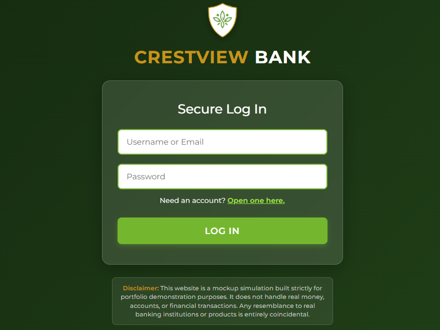
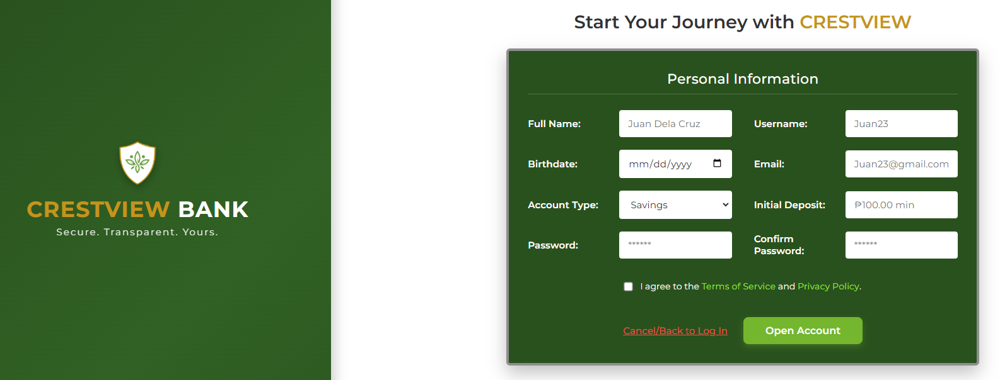
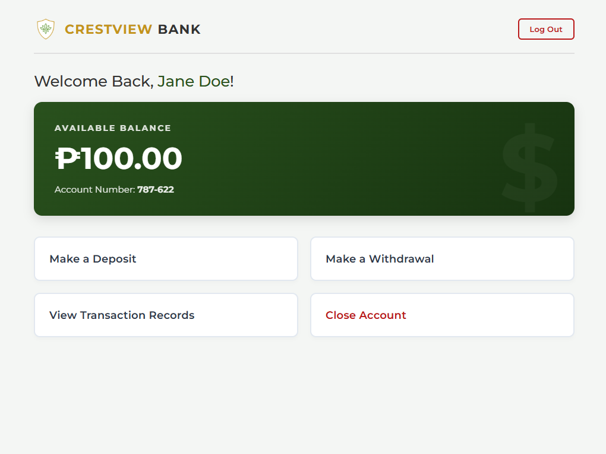
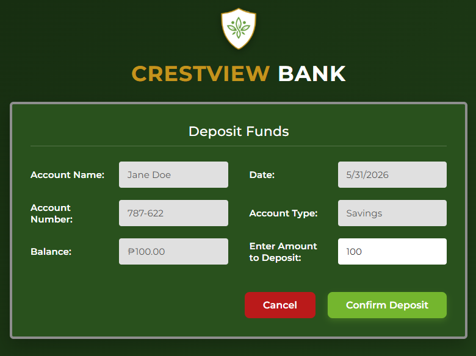
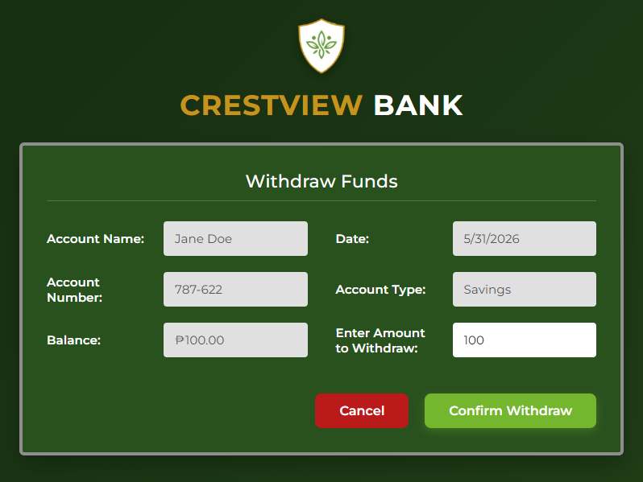
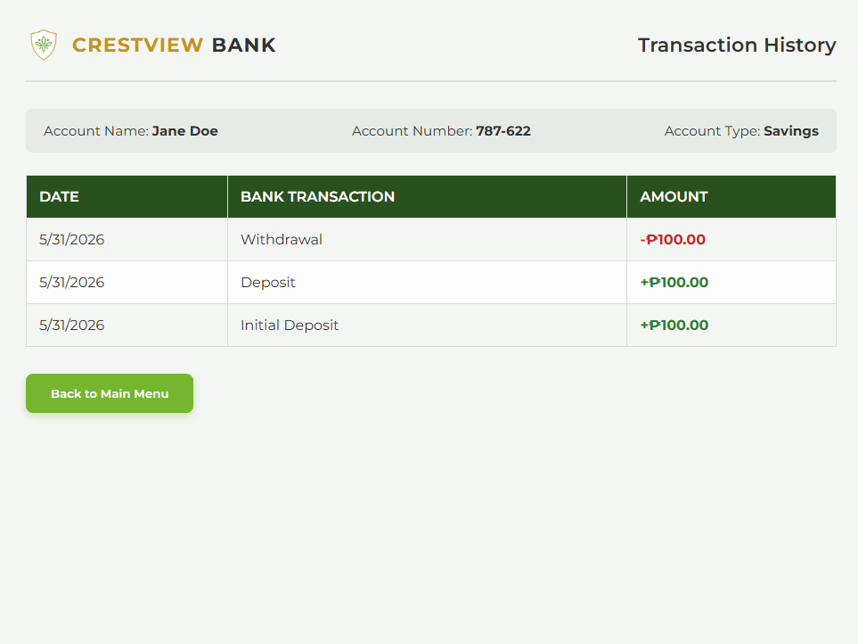
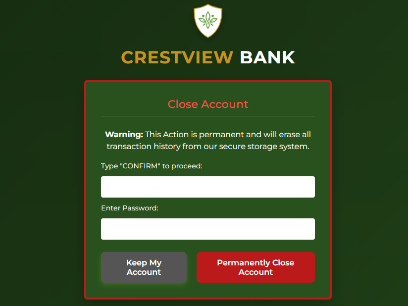

# Crestview Bank - Simple Bank Simulation

Crestview Bank is a clean, interactive banking website simulation. It features a modern dark green theme with smooth layouts and handles everything directly in the browser—meaning it saves all your data using your browser's local storage without needing an external database.

## 🚀 Live Demo
Check out the live website here: 
👉 **https://crestview-bank.pages.dev**

---

## 📸 Interface Screenshots

<details>
<summary>🔍 Click to expand and view all app pages</summary>

### 1. Secure Log In Page
*Features the custom ambient background, glassmorphism login card, and project disclaimer.*


### 2. Open Account (Registration)
*A responsive split-pane layout to register profile credentials and capture initial deposits.*


### 3. Main Dashboard
*Displays personalized session data, real-time balance calculations, and primary navigation actions.*


### 4. Deposit Funds
*Dynamic contextual transaction screen formatted specifically for handling input deposits.*


### 5. Make a Withdrawal
*The same dynamic form automatically re-configured to process withdrawals with account safety boundaries.*


### 6. Transaction History Ledger
*A clean data table displaying past credits, debits, and time-stamped activity.*


### 7. Close Account View
*A multi-factor verification gate requiring password and text confirmation before scrubbing user files.*


</details>

---

## ✨ Features

- **Single File Setup:** HTML, CSS styling, and JavaScript logic are all built into one single file, making it incredibly easy to open and run.
- **User Login:** A secure login screen that checks your credentials against the accounts saved in your browser.
- **Easy Sign-Up:** A clear registration page that takes your info, generates a random account number, and sets up your starting balance.
- **Main Dashboard:** Shows your name, account number, and available balance clearly at a glance.
- **Deposits & Withdrawals:** Simple forms that let you add or take out money from your account instantly.
- **🛑 ₱100 Minimum Limit:** Built-in blocks that prevent users from depositing or withdrawing any amount less than ₱100.00.
- **Transaction History:** A clean table layout that tracks all your past credit and debit actions with dates.
- **Close Account Option:** A permanent delete feature that clears your data from the browser after you type "CONFIRM" and verify your password.

---

## 🛠️ Built With

- **HTML5:** Used to build the structure of the pages and the screen transitions.
- **CSS3:** Custom styles, dark green theme gradients, and layout controls that make the app look good on both phones and desktops.
- **JavaScript:** Handles all the math, login checks, and database updates instantly.

---

## 📂 Project Layout

```text
crestview-bank/
│
├── index.html          # The main file (holds all the HTML, CSS, and JS code together)
├── images/             # Folder for project branding graphics
│   └── crestview-logo.png
└── screenshots/        # Folder containing user interface screenshots
    ├── login.png
    ├── register.png
    ├── dashboard.png
    ├── deposit.png
    ├── withdraw.png
    ├── history.png
    └── close-account.png
